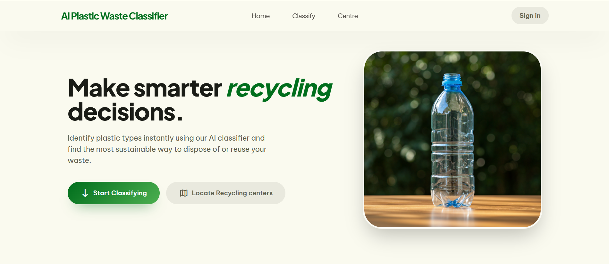
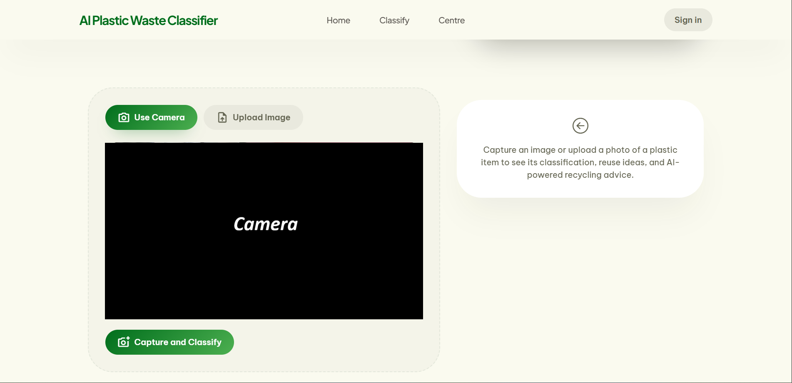
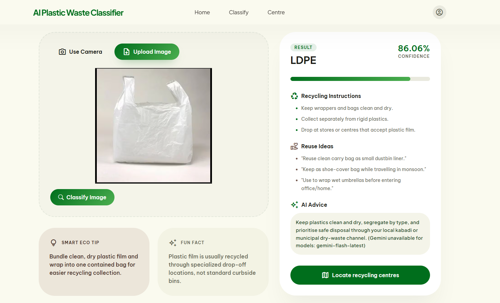
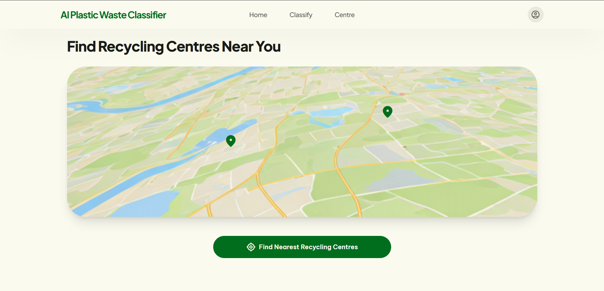

# AI Plastic Waste Classifier

A Flask + TensorFlow web app that classifies plastic waste from camera/upload images, provides AI-based reuse/recycling guidance, and locates nearby recycling centres.


## Table of Contents
- Features
- Tech Stack
- Project Structure
- How It Works
- Screenshots
- Demo
- Architecture
- Authentication Flow (Google via Supabase)
- API Endpoints
- Getting Started
- Environment Variables
- Run Locally
- Deployment Notes
- Troubleshooting
- Security Notes
- FAQ
- Roadmap
- Acknowledgments
- Maintainer
- Contributing
- License

## Features
- Plastic classification from image input using a trained TensorFlow/Keras model (`.h5`).
- Camera and upload modes in a responsive UI.
- Structured sustainability guidance:
  - Recycling instructions
  - Reuse ideas
  - AI advice
- Nearby recycler discovery using geolocation + Overpass API.
- Google-only authentication using Supabase.
- Basic production hardening:
  - Request size limit
  - Security headers
  - Generic 500 error responses

## Tech Stack
- Backend: Flask
- ML: TensorFlow 2.15.1, Keras 2.15.0, OpenCV, NumPy
- Frontend: HTML, Tailwind CSS, vanilla JavaScript, Leaflet
- Auth: Supabase Auth (Google OAuth)
- AI text guidance: Google Gemini API
- Deployment: Render + Gunicorn

## Project Structure
```text
.
|-- app.py
|-- requirements.txt
|-- render.yaml
|-- runtime.txt
|-- .python-version
|-- services/
|   |-- gemini_service.py
|   `-- recycler_service.py
|-- static/
|   |-- css/
|   `-- js/
|       |-- app.js
|       |-- auth.js
|       |-- camera.js
|       |-- map.js
|       `-- upload.js
|-- templates/
|   `-- index.html
|-- plastic-ai-project/
|   |-- dataset/
|   `-- model/
|       `-- plastic_model.h5
`-- README.md
```

## How It Works
1. User opens the web app.
2. User signs in with Google when accessing protected actions.
3. Image is captured/uploaded and sent to `/predict`.
4. Backend preprocesses image to `224x224`, runs model inference, and returns class + confidence.
5. Gemini service returns structured guidance for the detected plastic type.
6. User can request nearby recyclers via `/recyclers` using browser geolocation.

## Screenshots
### Home


### Classifier


### Result


### Map


## Demo
- Local URL: `http://localhost:5000`
- Public demo: Add your deployed URL here (Render/Vercel frontend + backend host).

## Authentication Flow (Google via Supabase)
- Public pages can load without sign-in.
- Protected actions (`/predict`, `/recyclers`) require a valid Supabase bearer token.
- Frontend obtains token from Supabase session and sends:
  - `Authorization: Bearer <access_token>`
- Backend validates token against Supabase user endpoint before processing.

## Architecture
```text
Browser UI (Tailwind + JS)
    |
    | 1) Image upload/camera capture
    v
Flask API (app.py)
    |-- /predict ----> TensorFlow model (.h5)
    |                  |
    |                  +--> Gemini guidance service
    |
    |-- /recyclers --> Overpass API (nearby centres)
    |
    +-- /home-insights -> Gemini lightweight tips/facts

Auth path:
Browser <-> Supabase Auth (Google OAuth)
Browser -> Flask protected routes (Bearer token)
Flask -> Supabase `/auth/v1/user` (token verification)
```

## API Endpoints
| Method | Route | Auth Required | Description |
|---|---|---:|---|
| GET | `/` | No | Main UI page |
| POST | `/predict` | Yes | Classify plastic image and return guidance |
| POST | `/recyclers` | Yes | Fetch nearby recycling centres |
| GET | `/home-insights` | No | Return homepage eco tip/fact |

### Example: `/predict` Request Body
```json
{
  "image": "data:image/jpeg;base64,..."
}
```

### Example: `/predict` Response
```json
{
  "type": "PET",
  "confidence": 98.21,
  "reuse": ["\"Use as dry storage\""],
  "recycle_instructions": ["Rinse and sort in dry waste"],
  "ai_advice": "Prefer local authorized channels for recycling."
}
```

## Getting Started
### Prerequisites
- Python 3.11
- pip
- Git

### Installation (Windows PowerShell)
```powershell
git clone https://github.com/Nikesh1626/ML-miniproject2.git
cd ML-miniproject2
python -m venv venv
.\venv\Scripts\Activate.ps1
pip install -r requirements.txt
```

### Installation (Linux/macOS)
```bash
git clone https://github.com/Nikesh1626/ML-miniproject2.git
cd ML-miniproject2
python3 -m venv venv
source venv/bin/activate
pip install -r requirements.txt
```

## Environment Variables
Create a `.env` file in the project root.

```env
GEMINI_API_KEY=your_key_here
GEMINI_MODEL=gemini-flash-latest
GEMINI_LIGHT_MODEL=gemini-flash-lite-latest

FLASK_DEBUG=false
MODEL_PATH=plastic-ai-project/model/plastic_model.h5
MAX_CONTENT_LENGTH_MB=8
RECYCLER_RADIUS_METERS=50000

SUPABASE_URL=https://your-project-ref.supabase.co
SUPABASE_ANON_KEY=your_anon_key_here
```

## Run Locally
```powershell
.\venv\Scripts\Activate.ps1
py app.py
```

Open: `http://localhost:5000`

## Deployment Notes
This repo includes Render config:
- `render.yaml` with Gunicorn start command
- `runtime.txt` and `.python-version` for Python pinning

Start command used:
```bash
gunicorn app:app --bind 0.0.0.0:$PORT --workers 1 --threads 2 --timeout 180
```

## Troubleshooting
### 1) TensorFlow/Keras model load issues
- Use Python 3.11 and pinned versions from `requirements.txt`.
- If you see `DepthwiseConv2D` deserialization issues, verify exact TensorFlow/Keras versions.

### 2) Google login not working
- Check Supabase Google provider is enabled.
- Verify Google OAuth redirect URI exactly matches Supabase callback URL.
- Confirm Supabase `Site URL` and additional redirect URLs include your localhost URL.

### 3) `SUPABASE_URL` / `SUPABASE_ANON_KEY` missing
- Authentication will be unavailable if either is empty.
- Set them in `.env` and restart server.

### 4) Geolocation/map errors
- Allow browser location permission.
- Overpass endpoints may time out occasionally; retry after a short wait.

### 5) Camera not opening on mobile LAN
- Some mobile browsers restrict camera on non-HTTPS origins.
- Use upload mode on HTTP LAN or use an HTTPS tunnel for camera testing.

## Security Notes
- Never commit `.env`.
- Use only Supabase anon key in frontend/browser contexts.
- Never expose Supabase service_role or Google OAuth secrets.
- Rotate keys immediately if accidentally exposed.

## FAQ
### Why does login work only for specific users in Google OAuth testing mode?
Google only allows configured test users until you publish the OAuth consent screen to production.

### Why do I get 401 on `/predict` or `/recyclers`?
The route is protected. Ensure the user is signed in and a valid bearer token is being sent.

### Can I run this without Supabase auth?
Current route protection expects Supabase auth for protected endpoints.

## Roadmap
- Add prediction history per user.
- Add unit/integration tests for API routes.
- Add CI for linting/tests.
- Improve recycler query fallback and caching.

## Acknowledgments
- TensorFlow/Keras for model inference tooling
- Supabase for authentication
- OpenStreetMap and Overpass for recycler location data
- Leaflet for map rendering

## Maintainer
- Nikesh Parihar
- LinkedIn: https://www.linkedin.com/in/nikeshparihar26/

## Contributing
1. Fork the repo.
2. Create a feature branch.
3. Commit with clear messages.
4. Open a pull request.

## License
Distributed under the MIT License. See `LICENSE` for details.
